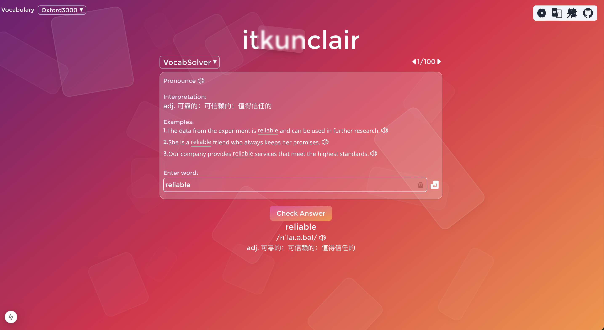
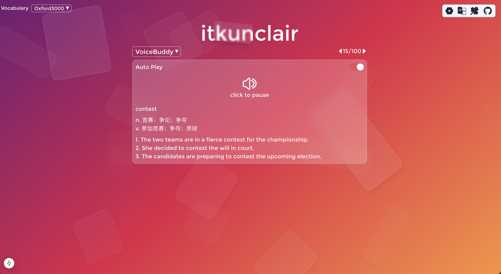

## itkunclair

Welcome to **itkunClair** !

This project is an english training app, currently it includes **VocabSolver** and **VoiceBuddy** 2 training sections.

The word data are fully generated by AI, how does it work: 
1. triggerred by github action to pick up the task every day.
2. calling Huggingface modal(or local modal) to for word data generation.

It also provide script to seed the word data into mongodb, which will automatically triggerred on `npm run docker-compose`.

<hr />

### Getting Started

This project provides an efficient setup to get your application up and running with two approaches:

1. **Using Docker**: The simplest way to get started with just a single command.
2. **Without Docker**: A manual setup in three steps, for those who prefer not to use Docker.

#### Prerequisites

- Ensure you have [Node.js](https://nodejs.org/en) installed.
- If using Docker, ensure [Docker](https://www.docker.com/) and [Docker Compose](https://docs.docker.com/compose/install/) are installed.

### Approach 1: Quick Start with Docker 🐳

Docker will automatically pull the necessary images, set up the MongoDB instance, seed data, and start the application.

Run the command:

```bash
npm run docker-compose
```

### Approach 2: Manual Setup (Without Docker) ⚙️

1. Copy the `.env.template` and change name as `.env`, then replace the MONGODB_URI with your personal mongodb url.

```dotenv
MONGODB_URI="mongodb://127.0.0.1:27017/itkunclair"
```

2. Seed the database:

```bash
    npm run seed
    # or you can override the existing table in same database
    npm run seed -- --override
```

3. start the application, then

```bash
npm run start
```

The application should now be running at [http://localhost:3000](http://localhost:3000).

## Todo List

- [x] &nbsp;Integrate mongodb into docker. </br>
- [x] &nbsp;AI Batch Task: automatic word data generation </br>
- [ ] &nbsp;Change useLocate to i18n.</br>
- [x] &nbsp;Data persistence </br>
- [x] &nbsp;Feature add 'Automatic play the words and examples. </br>
- [x] &nbsp;Add Pronunciation ability </br>
- [ ] &nbsp;Integrate AI to come up with the training suggestion. </br>

### [Contributors](https://github.com/0753Lar/ItkunClair/graphs/contributors)


### Screenshot

<div style="display: flex; flex-wrap: wrap;">
    
    
</div>
